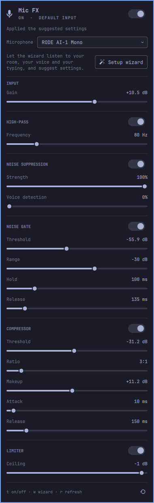
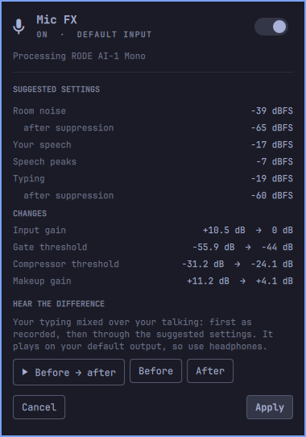

# Mic FX for Omarchy

An [Omarchy](https://omarchy.org) shell (Quickshell) bar widget that cleans up
your microphone for **every app**: Zoom, Teams, Discord, browsers. No OBS
needed.

It puts a processed copy of your mic in front of the real one, as a virtual
input that becomes your default:

**input gain → high-pass → RNNoise noise suppression → noise gate → tone → compressor → limiter**

A setup wizard listens to your room, your voice and your typing, then suggests
settings.

What changed in each release is in [CHANGELOG.md](CHANGELOG.md).



## What you get

- **Bar icon** — a microphone, dimmed when Mic FX is off. Hovering shows its
  state.
- **Panel**
  - an on/off switch. On makes the processed mic your default input and moves
    apps that are already recording onto it. Off gives everything back to the
    raw mic.
  - a microphone picker, for when you have more than one. Switching restarts
    the chain on the new mic, and Mic FX stays your default input if it was.
  - **Sample**: record ten seconds of your raw mic, then loop it through your
    settings while you adjust them, and flip to the original to compare. It
    plays through a private copy of the chain on your default output, so
    calls using Mic FX aren't touched. The loop stops when the panel closes,
    and the recording lives in your runtime directory like the wizard's clips.
  - one line per stage, with its own switch and a summary of what it's doing
    (`−50 dB`, `nasal −5 dB @ 1.1 kHz`). Click a stage to open its everyday
    sliders; **More** shows the rest (attack, release, frequencies and
    widths). Stages start closed each time the panel opens. An open stage that differs
    from its defaults shows a reset icon that puts just that stage back. Changes apply
    live, without interrupting a call.
  - **Setup wizard**: three short recordings (quiet, talking, typing) with live
    before/after level meters. It then shows what it measured and the settings
    it suggests, as a list of *current → suggested*, and lets you hear your
    typing over your talking before and after, so you can decide by ear.
- Everything runs locally. No audio leaves your machine.

## Tone: if you sound nasal or boxy

**TONE** is a small EQ, off until you switch it on. It uses PipeWire's own
filters, so there's nothing extra to install. Cut first, then boost:

| Control | What it does | Start with |
|---|---|---|
| **Nasal cut** | a narrow bell where a voice sounds honky, "in your nose" | −3 to −6 dB |
| **Nasal frequency** | where it sits, usually 800 Hz – 1.5 kHz | 1 kHz |
| **Nasal width (Q)** | higher is narrower. Sweep narrow (4–8), settle wider if it sounds better | 4 |
| **Boxiness cut** | a milder bell for boxy, muddy-nasal tone | 0 to −3 dB |
| **Boxiness frequency** | usually 300 – 500 Hz | 400 Hz |
| **Presence** | a gentle bell boost for clarity | 0 to +2 dB |
| **Presence frequency** | usually 3 – 5 kHz | 4 kHz |
| **Air** | a shelf boost that offsets the darker tone a cut can leave | 0 to +2 dB |
| **Air frequency** | where the shelf starts, usually 8 – 10 kHz | 10 kHz |

To find your nasal frequency, use **SAMPLE** in the panel, with headphones on:
**Record** ten seconds of yourself talking, then **Loop** it. Everything you
change applies to the loop straight away, and **Original** / **With settings**
flip between the recording as it was and through your settings. Listening to a
recording works far better than listening to yourself live, where the sound of
your own voice in your head drowns out small changes.

Set **Nasal cut** to −9 dB and **Width** to 6, sweep **Nasal frequency** slowly
from 800 Hz to 1.5 kHz while you talk, and stop where the honk goes away. Then
ease the cut back to −3 to −6 dB: more than that sounds muffled. Do the same
for boxiness between 300 and 500 Hz if you hear it. Only then add presence or
air.

Tone comes after the gate, so the gate still judges your natural voice, and
before the compressor and limiter, so they don't react to the resonance you're
cutting.

## The wizard

| Step | You | It measures |
|---|---|---|
| 1 · Stay quiet (8 s) | sit at the mic, silent | the room's noise floor, before and after RNNoise |
| 2 · Talk normally (12 s) | talk as you would on a call | your speech level, peaks, and the quietest syllables after RNNoise |
| 3 · Type (10 s) | type in the box it gives you, without talking | how much keyboard noise gets through RNNoise |

From those it suggests:

- **Input gain**, bringing your average speech to about −24 dBFS. If that
  would take more than about 12 dB, it suggests turning up your interface's
  gain knob instead, since digital gain raises the noise with it. If your
  loudest sounds come within 4 dB of full scale, it tells you to turn the
  knob down instead: clipping happens in the interface, before Mic FX.
- **Gate threshold**, between the loudest typing and your quietest speech
  after suppression. If the two overlap, it switches on RNNoise's voice
  detection to cut typing between words.
- **Compressor threshold and makeup**, relative to your speech, for an output
  that averages about −18 dBFS.
- **Limiter** at −1 dBFS.



While the wizard records, the gate, compressor and limiter are bypassed, so it
measures exactly what the gate would see. Your settings come back afterwards,
however the recording ends.

**Hear the difference.** The last step mixes your typing over your talking
and plays it twice: as recorded, then through the suggested settings. The
processed version comes from a throwaway copy of the chain, fed through a
temporary silent output, so your real chain, and any call using it, is never
touched. It plays on your default output, so use headphones.

The talking and typing clips are kept only in your memory-backed runtime
directory (`$XDG_RUNTIME_DIR/omarchy-mic-fx/`, private to you and gone at
logout), and are deleted when the wizard closes, however it closes.

## Requirements

- Omarchy 4 ("Quattro") or newer, i.e. the Quickshell-based shell.
- PipeWire with filter-chain LV2 and LADSPA support (standard on Omarchy).
- `noise-suppression-for-voice` (RNNoise) and `lsp-plugins-lv2` (gate,
  compressor, limiter), from the official repos:

  ```bash
  omarchy pkg add noise-suppression-for-voice lsp-plugins-lv2
  ```

- `python3`, which runs the bundled helper.

## Install

```bash
omarchy plugin add https://github.com/codemonkey76/omarchy-micfx --enable
```

Or by hand:

```bash
git clone https://github.com/codemonkey76/omarchy-micfx \
  ~/.config/omarchy/plugins/io.github.codemonkey76.micfx
```

Then add `{ "id": "io.github.codemonkey76.micfx" }` to a bar section in
`~/.config/omarchy/shell.json` if it isn't placed automatically, and run
`omarchy restart shell`.

## Configuration

**There is nothing you have to configure.** Your processing settings are set
from the panel (or the wizard) and saved for you.

One optional setting, on the widget's entry in `~/.config/omarchy/shell.json`:

```jsonc
{
  "id": "io.github.codemonkey76.micfx",
  "refreshSeconds": 10
}
```

`refreshSeconds` is how often the bar icon re-reads Mic FX's state while the
panel is closed (default 10, minimum 3). While the panel is open it always
polls every 3 seconds.

## Usage

| Action | Result |
|---|---|
| Left click | Open / close the panel |
| Right click | Switch Mic FX on / off |
| Middle click | Force a refresh |
| `t` (panel open) | Switch Mic FX on / off |
| `w` (panel open) | Open the setup wizard |
| `r` (panel open) | Refresh |
| `Esc` | Close the wizard if it's open, otherwise the panel |

The letter keys do nothing while the wizard is open, so they can't fire while
you're typing in step 3.

### From scripts and keybindings

```bash
omarchy-shell io.github.codemonkey76.micfx toggle   # open/close the panel; also: open, close
omarchy-shell io.github.codemonkey76.micfx enable   # also: disable
omarchy-shell io.github.codemonkey76.micfx setup    # open the wizard
omarchy-shell io.github.codemonkey76.micfx refresh
omarchy-shell io.github.codemonkey76.micfx status   # one line, as in the tooltip
```

## How it works

The bundled `omarchy-mic-fx` helper writes a PipeWire filter-chain config and
a systemd user service that hosts it in its own PipeWire client. That's the
same way Omarchy hosts its speaker tuning, so switching Mic FX on and off never
restarts the audio daemon or disconnects other apps.

| File | What |
|---|---|
| `~/.config/omarchy-mic-fx/settings.json` | your settings, in dB / ms / ratio |
| `~/.config/pipewire/omarchy-mic-fx.conf` | the generated chain (rewritten on every change) |
| `~/.config/systemd/user/omarchy-mic-fx.service` | the service that hosts it |
| `~/.local/state/omarchy-mic-fx/` | the previous default input, and the wizard's measurements (per-100 ms levels, no audio) |
| `$XDG_RUNTIME_DIR/omarchy-mic-fx/` | the wizard's talking and typing clips and their preview, only while the wizard is open; your sample, until logout or a new one |

Settings change live through `pw-cli set-param`, and are read back from
PipeWire before the widget reports them applied. The chain is a plain
filter-chain source, not a WirePlumber smart filter. On PipeWire 1.6.8 a
smart filter loads but passes audio through unprocessed, as Omarchy's own
speaker tuning found.

Files are written without following symlinks and replaced atomically, and
preview clips are played from memory rather than re-opened by path. The only
audio the wizard ever keeps is its clips, in the runtime directory, for as
long as it's open.

Nothing is run by name through `PATH`, and nothing is resolved twice. The
widget starts the bundled helper as `/usr/bin/python3`, and the helper finds
`pactl`, `pw-cli`, `pw-dump`, `parec`, `pacat`, `pipewire` and `systemctl` in
`/usr/bin`, which it opens one directory at a time from `/`, checking that root
owns each one and no one else can write to it. A program is accepted only if
the descriptor it opened -- without following a symlink, except one root wrote
inside that same directory -- is a real executable that no one but root can
replace, and that descriptor is then what runs. Nothing can swap the file out
between the check and the start. Each one starts from a closed environment --
the handful of variables PipeWire, PulseAudio and `systemctl --user` need to
find your session, and nothing else -- in a process group of its own, so
stopping one stops everything it started. Output is read as it arrives against
a size ceiling rather than buffered whole, recordings stop at a couple of
seconds past the length asked for, and every call has a deadline the widget
enforces: past it the helper is asked to stop, and killed if it hasn't gone
five seconds later.

### Command line

The helper works on its own too. It lives in the plugin directory,
`~/.config/omarchy/plugins/io.github.codemonkey76.micfx/omarchy-mic-fx`:

```bash
omarchy-mic-fx status             # JSON
omarchy-mic-fx on                 # also: off, default
omarchy-mic-fx set gate.threshold -48
omarchy-mic-fx set tone.enabled on
omarchy-mic-fx set tone.nasal.cut -5
omarchy-mic-fx reset              # back to the default settings
omarchy-mic-fx reset tone         # just one stage: input, hpf, suppress, gate, tone, comp, limit
omarchy-mic-fx devices            # inputs it can process
omarchy-mic-fx device <name>      # process a different one
omarchy-mic-fx calibrate quiet 8  # also: speech, typing, solve, apply
omarchy-mic-fx sample record 10   # then: sample play processed (or original), sample clear
```

`omarchy-mic-fx --help` prints the full list.

## Removal

```bash
~/.config/omarchy/plugins/io.github.codemonkey76.micfx/omarchy-mic-fx uninstall
omarchy plugin remove io.github.codemonkey76.micfx
rm -rf ~/.config/omarchy-mic-fx ~/.local/state/omarchy-mic-fx
```

`uninstall` stops the service, gives the default input back to your mic, and
removes the service and chain config. Run it **before** removing the plugin,
since it ships inside the plugin's directory.

## License

MIT — see [LICENSE](LICENSE).
